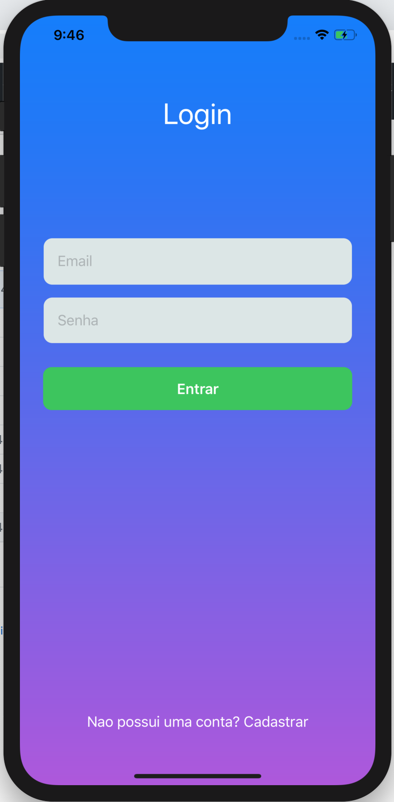

   
  

   

<h1 align="center">Experimento com SwiftUI</h1>

## 📱 **Tela de Login com SwiftUI**

### Uma simples tela de Login feita com SwiftUI
 

   
  
   

   
  
#### Foi somente um experimento motivado pela curiosidade, o código ta feião não me julguem 🤷‍♂️
